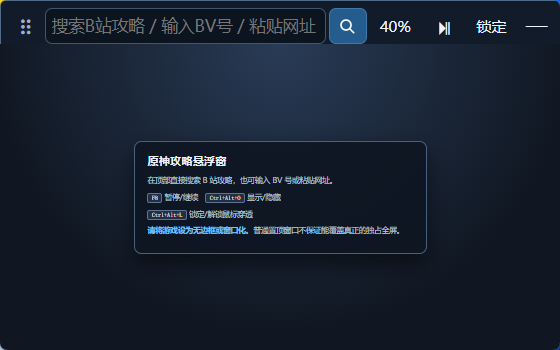

# 原神攻略悬浮窗

这是一个独立的 Windows 攻略伴侣程序，用 WebView2 在游戏上方显示网页或视频攻略。它只控制攻略视频，不读取或修改游戏进程，不向游戏模拟键鼠输入。

## 界面预览



截图使用全新临时配置生成，仅展示程序自带的本地欢迎页，不包含账号状态、搜索历史或第三方攻略内容。

## 使用

1. 将《原神》改为“无边框”或“窗口化”。
2. 启动 `GenshinGuideOverlay-Windows-v0.1.10-portable.exe`。
3. 在顶部输入攻略关键词并按回车或点“搜索”；也可输入完整 BV/av 号，或粘贴 B 站及其他 HTTP/HTTPS 攻略地址。
4. 点击结果后进入 B 站纯播放器。顶部紧凑的“←”返回上一级搜索结果；搜索词会保存，程序重启后也能重新获取上一组结果。
5. “画质”会优先打开 B 站播放器原生清晰度菜单。若当前嵌入页未提供菜单，程序会显示实际视频源高度；播放器地址会请求可用最高画质，但不保证 B 站一定下发 1080P。
6. 用紧凑倍速下拉框选择 `0.5× / 0.75× / 1× / 1.25× / 1.5× / 2×`；档位会保存，并在切换视频后自动恢复。
7. 用顶部“−10 / +10”或默认全局快捷键 `Ctrl+Alt+Left / Ctrl+Alt+Right` 快退/快进 10 秒；到达视频起点或结尾时会自动限制在有效范围。
8. 多分集视频可点顶部“上一集 / 下一集”：同一个 BV 内按 B 站分集顺序切换；到达首 P 或末 P 后，再进入 B 站合集的上一或下一视频。跨到上一视频时会落到它的最后一 P，两个方向可以往返；不会跳到随机推荐。
9. 用顶部“⏯”或默认全局快捷键 `Ctrl+Alt+Space` 暂停/继续最大可见视频。
10. 点顶部“按键”，再点击需要修改的输入框并直接按下新键盘组合；播放/暂停、快退、快进、显示/隐藏和锁定/解锁五项都可独立录制，保存后立即生效。录制时按 `Esc` 取消。
11. 调整好位置后按默认快捷键 `Ctrl+Alt+L` 锁定；控制条隐藏、窗口鼠标穿透。再次按下可解锁。

关闭按钮只会把窗口收到系统托盘；真正退出请使用托盘菜单“退出”。

## 播放器精简

- 隐藏嵌入播放器的大标题、作者关注层、站点 DOM 标识和“进入哔哩哔哩/观看更高清”推广提示。
- 底部进度条、时间、音量和播放控件改为更小的半透明布局，鼠标移入时恢复较高可见度。
- 视频画面像素中自带的作者或平台水印不属于网页控件，无法在不裁剪画面的前提下单独移除。

## 快捷键

| 默认快捷键 | 功能 |
| --- | --- |
| `Ctrl+Alt+Space` | 暂停/继续攻略视频；可录制为其他受系统支持的键盘组合 |
| `Ctrl+Alt+Left` | 快退 10 秒；可录制为其他受系统支持的键盘组合 |
| `Ctrl+Alt+Right` | 快进 10 秒；可录制为其他受系统支持的键盘组合 |
| `Ctrl+Alt+O` | 显示/隐藏悬浮窗；可录制为其他受系统支持的键盘组合 |
| `Ctrl+Alt+L` | 锁定/解锁鼠标穿透；可录制为其他受系统支持的键盘组合 |
| `Ctrl+Alt+↑` | 透明度提高 10% |
| `Ctrl+Alt+↓` | 透明度降低 10% |

前五项在独立的快捷键设置窗口中直接录制并统一保存，不再使用预设下拉框。五项不能互相重复；若新组合被系统保留或被其他程序占用，程序会恢复保存前仍可用的组合并给出提示。`Ctrl+Alt+↑/↓` 保持固定，不能分配给前五项。当前只录制键盘键，不支持鼠标侧键。锁定或隐藏后仍可通过全局快捷键和系统托盘恢复。

## 构建

需要 Windows 10/11、Node.js/npm、Rust stable 和 WebView2 Runtime。在本目录执行：

```powershell
npm ci
powershell.exe -NoProfile -ExecutionPolicy Bypass -File .\build_windows.ps1
```

脚本会依次运行前端语法检查、Rust 单元测试、Tauri 发布构建，并把便携版及 NSIS 安装包复制到项目根目录的 `dist` 中。

开发模式：

```powershell
npm run dev
```

用户设置保存在：

```text
%APPDATA%\com.renlong.genshinguideoverlay\settings.json
```

## 0.1.10 验证结果

- JavaScript 语法检查、44 项 Rust 单元测试、`cargo fmt --check` 和 Clippy `-D warnings` 均通过；Release + NSIS 构建通过。
- 551×407 发布态控制条已做截图复核：拖动柄改为双列抓手，返回入口明确显示“←搜”，搜索改为带完整无障碍名称的紧凑图标，输入框由约 72 物理像素增至约 98 物理像素；“上一集 / 下一集”使用低对比分组底色，异步查询时会一起变淡并显示等待光标。
- 静态 Chromium 在 441、530、551 三档 CSS 宽度均确认 `scrollWidth == clientWidth`；发布态 UIA 确认搜索、快退/播放/快进、上一集、下一集、锁定和隐藏全部位于控制条边界内。
- 发布态实测中文关键词返回 4 个当前可用结果，点选后进入纯播放器；内存返回约 586 毫秒，重启后能用保存的搜索词重新获取结果。
- 实测大标题、作者关注层和站点 DOM 标识可见数量均为 0；推广提示已隐藏，底部控制层已压缩。
- “画质”会探测原生菜单和实际视频高度。当前测试视频源约为 360P，B 站嵌入页未提供切换菜单，程序没有将其误报为最高画质。
- 发布态倍速下拉框已显示，选择 `1.5×` 后调用真实 HTML5 视频的 `playbackRate` 并持久化；播放器重新加载时会恢复保存的档位。
- 实测顶部“−10 / +10”可改变真实 HTML5 视频的 `currentTime`，并显示“已快退/已快进 10 秒”；默认 `Ctrl+Alt+Left / Ctrl+Alt+Right` 全局快捷键也已发出同样的实际跳转。
- “上一集 / 下一集”只读取 B 站结构化的 `pages` 与 `ugc_season`：同 BV 内按 API 数组顺序切换，首尾才跨合集；上一视频会选其最后一个有效 P。越界或单集会明确提示，不读取推荐列表。
- 发布态在用户原有 551×407 窗口中确认“上一集”“下一集”、锁定和隐藏按钮均完整可见。31P 样本 `BV1BMgj6MEz4` 已从 P2 切到 P1，再由“下一集”回到 P2；合集样本 `BV1Af4y187Db` 的“上一集”实际落到前一视频 `BV1Dt4y1S7tG?p=192`，再点“下一集”可返回。
- 单集样本 `BV1HegH6dEWL` 会提示“当前视频没有上一集”，保存地址保持不变，没有打开推荐视频。第二次启动会正常退出，只保留一个 0.1.9 实例。
- 实测快捷键设置窗口默认隐藏、由顶部“按键”打开；五个录制框可完整显示和保存。通用解析覆盖字母、数字、F1-F24、方向键、小键盘和常用控制/媒体键，五项注册与设置写入按同一事务处理，失败会回滚。
- 主控制页和独立快捷键页分别只获得所需的 Tauri IPC 权限，搜索结果页和远程攻略页没有。

发布文件：

```text
GenshinGuideOverlay-Windows-v0.1.10-portable.exe
  10,738,176 bytes
  SHA-256 0b8148e828d0feec0140063c598f2998b85f72d7e8ea6f4d38b4e11d3cf20512

GenshinGuideOverlay-Windows-v0.1.10-setup.exe
  2,383,033 bytes
  SHA-256 28826956f8c8aae7c5eb19344673136e63fbcc166e2cf79f0fd488a436b27752
```

当前是本地未签名构建，Windows SmartScreen 可能提示未知发布者。

## 已知边界

- 普通置顶窗口只保证在窗口化/无边框游戏上方显示，不保证覆盖真正的独占全屏、UAC 安全桌面或受保护视频层。
- B 站播放器的 `high_quality=1` 只是“请求可用最高画质”，不是清晰度权限；未登录、嵌入限制或源站策略可能只下发较低分辨率且不显示切换菜单。
- 页面元素可以缩小或隐藏，但视频帧内烧录的作者、平台水印不能单独隐藏；强行去除只能裁剪画面，会损失视野。
- 集成搜索依赖 B 站当前搜索接口和图片 CDN，需要联网，当前只展示第一页视频。接口、反滥用规则或字段变更后可能需要更新适配。
- “上一集 / 下一集”依赖 B 站当前视频元数据接口，只支持同视频分集和 B 站合集；普通单集、合集边界或接口暂时不可用时不会跳转到推荐视频。若合集上一视频缺少可确认的分集列表，程序会停留当前页，而不是猜测为 P1。
- 纯视频适配明确覆盖标准 B 站 `/video/BV...`、`/video/av...` 和播放器地址；`b23.tv` 短链需先在浏览器展开后再粘贴，其他网站按普通攻略网页显示。
- 暂停/继续和快退/快进都会查找页面中最大的 HTML5 视频；跨域 iframe、DRM 或特殊自定义播放器可能无法控制，程序不会假报成功。
- 网页登录状态由系统 WebView2 用户数据保持；请只打开你信任且有权访问的攻略地址。
